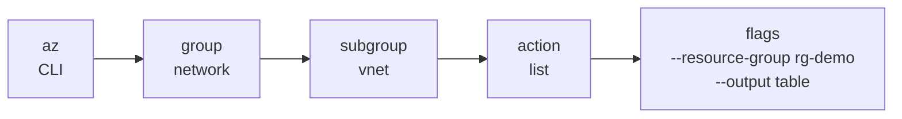
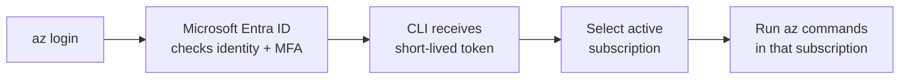
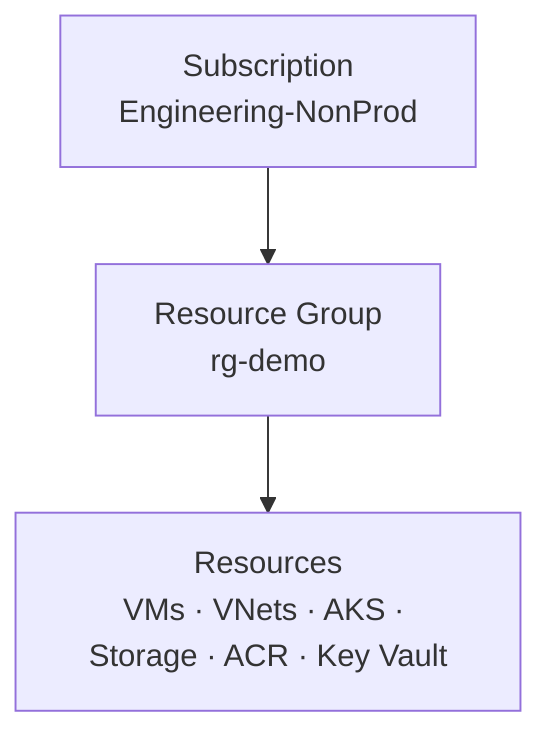
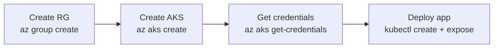

# Azure CLI (`az`) Cheatsheet

Internal team reference for Linux/Bash users who know basic cloud but are new to Azure CLI.

> Last verified: **17 August 2026** against Azure CLI **2.89.1** and current Microsoft Learn command references.
>
> Examples use resource group `rg-demo` and region `centralindia`. Storage, ACR, and Key Vault names must be globally unique. If an example name is already taken, change only its numeric suffix.
>
> Expected outputs are shortened. Azure IDs, timestamps, public IPs, and generated values will be different in your environment.

## 1. How `az` commands are built: `az <group> <subgroup> <action> --flags`

Most Azure CLI commands read like a path followed by a verb:

```text
az <group> <subgroup> <action> --flag value
```

- `az` starts the Azure CLI.
- A **group** is a service family, such as `network`, `vm`, or `aks`.
- A **subgroup** narrows the service, such as `vnet` under `network`. Some commands do not need one.
- An **action** is the operation, such as `create`, `list`, `show`, `update`, or `delete`.
- **Flags** provide names, locations, resource groups, output format, and other settings.



| Command | What it does | Example |
| --- | --- | --- |
| `az network vnet list` | Lists virtual networks | `az network vnet list --resource-group rg-demo --output table` |
| `az ... --help` | Shows valid flags and examples for that exact command | `az network vnet list --help` |

### Read one command from left to right

```bash
# List VNets from rg-demo and format the result as a readable table.
az network vnet list \
  --resource-group rg-demo \
  --output table
```

**What success looks like**

```text
Name       ResourceGroup  Location
---------  -------------  ------------
vnet-demo  rg-demo        centralindia
```

**⚠️ Watch out:** Azure CLI uses the currently selected subscription unless you pass `--subscription`. A valid command can succeed in the wrong subscription.

### Ask the CLI for help

```bash
# Show the supported flags and examples for this exact command.
az network vnet list --help
```

**What success looks like**

```text
Command
    az network vnet list : List virtual networks.
Arguments
    --resource-group -g ...
```

**⚠️ Watch out:** Online examples can be older than your installed CLI. `--help` shows what your installed version accepts.

Common short flags are `-g` for `--resource-group`, `-n` for `--name`, `-l` for `--location`, and `-o` for `--output`. Long flags are easier to read in shared scripts.

Official reference: [Azure CLI command index](https://learn.microsoft.com/en-us/cli/azure/reference-docs-index?view=azure-cli-latest)

## 2. Setup: install, `az login`, list/set subscription

Azure CLI stores a short-lived sign-in token locally. A **token** is a temporary digital pass that proves who you are.

| Command | What it does | Example |
| --- | --- | --- |
| Install on Ubuntu/Debian | Installs the current Azure CLI package | `curl -sL https://aka.ms/InstallAzureCLIDeb \| sudo bash` |
| Install on RHEL 8 | Adds Microsoft’s repository and installs the package | `sudo dnf install azure-cli` |
| `az version` | Shows the installed version | `az version --output table` |
| `az upgrade` | Upgrades Azure CLI and installed extensions | `az upgrade --yes` |
| `az login` | Signs in with a user account | `az login` |
| `az login --use-device-code` | Signs in on a headless server | `az login --use-device-code` |
| `az account list` | Lists subscriptions visible to you | `az account list --output table` |
| `az account set` | Selects the subscription used by later commands | `az account set --subscription "Engineering-NonProd"` |
| `az account show` | Shows the active subscription | `az account show --output table` |

### Install on Ubuntu or Debian

```bash
# Download Microsoft’s maintained installer and install Azure CLI.
curl -sL https://aka.ms/InstallAzureCLIDeb | sudo bash
```

**What success looks like**

```text
Setting up azure-cli ...
```

**⚠️ Watch out:** This pipes a downloaded script into `sudo bash`. On controlled servers, use Microsoft’s step-by-step package-repository instructions so your team can inspect and approve every step.

### Install on RHEL 8

```bash
# Import Microsoft’s package-signing key.
sudo rpm --import https://packages.microsoft.com/keys/microsoft.asc

# Add Microsoft’s RHEL 8 package repository.
sudo dnf install -y \
  https://packages.microsoft.com/config/rhel/8/packages-microsoft-prod.rpm

# Install Azure CLI from the configured repository.
sudo dnf install -y azure-cli
```

**What success looks like**

```text
Installed:
  azure-cli-...
Complete!
```

**⚠️ Watch out:** Use the repository package matching the OS major version. RHEL 9 uses `/config/rhel/9.0/`; RHEL 10 uses a newer signing key and `/config/rhel/10/`.

### Verify the installed version

```bash
# Show the Azure CLI version and its installed components.
az version --output table
```

**What success looks like**

```text
Azure-cli
---------
2.89.1
```

**⚠️ Watch out:** A much older CLI can reject new flags or silently use older defaults. Record the CLI version in CI job logs.

### Upgrade Azure CLI

```bash
# Upgrade Azure CLI and its installed extensions without asking for confirmation.
az upgrade --yes
```

**What success looks like**

```text
Your CLI is up-to-date.
```

**⚠️ Watch out:** `az upgrade` is available from CLI 2.11.0. On older installations, update through `apt`, `dnf`, Homebrew, or the original installer.

### Sign in interactively

```bash
# Open a browser, authenticate your user, and cache an Azure CLI token.
az login
```

**What success looks like**

```text
Retrieving tenants and subscriptions...
[
  {
    "name": "Engineering-NonProd",
    "isDefault": true
  }
]
```

**⚠️ Watch out:** Since September 2025, Microsoft requires MFA for user identities in Azure CLI. Do not use a personal user login for unattended scripts.

### Sign in from a headless server

```bash
# Print a device code that you complete in a browser on another machine.
az login --use-device-code
```

**What success looks like**

```text
To sign in, use a web browser to open https://microsoft.com/devicelogin
and enter the displayed code.
```

**⚠️ Watch out:** Never paste a device code into chat, email, or a ticket. Anyone who completes it during its lifetime can sign in as you.

### List subscriptions

```bash
# List every subscription your signed-in identity can access.
az account list \
  --query "[].{Name:name,SubscriptionId:id,State:state,Default:isDefault}" \
  --output table
```

**What success looks like**

```text
Name                 SubscriptionId                        State    Default
-------------------  ------------------------------------  -------  -------
Engineering-NonProd  11111111-2222-3333-4444-555555555555  Enabled  True
```

**⚠️ Watch out:** Subscription names can be duplicated or renamed. Use the subscription ID in production scripts.

### Select a subscription

```bash
# Make Engineering-NonProd the default subscription for later commands.
az account set --subscription "Engineering-NonProd"
```

**What success looks like**

```text
No output. Exit code 0 means the active subscription changed.
```

**⚠️ Watch out:** `az account set` changes local CLI context. It does not change a subscription on Azure. Verify the context immediately after switching.

### Confirm the active subscription

```bash
# Print the active subscription before creating or deleting anything.
az account show \
  --query "{Name:name,SubscriptionId:id,TenantId:tenantId,User:user.name}" \
  --output table
```

**What success looks like**

```text
Name                 SubscriptionId                        TenantId
-------------------  ------------------------------------  ------------------------------------
Engineering-NonProd  11111111-2222-3333-4444-555555555555  aaaaaaaa-bbbb-cccc-dddd-eeeeeeeeeeee
```

**⚠️ Watch out:** Put this check at the start of destructive scripts. A wrong active subscription is one of the easiest ways to damage the wrong environment.



**Simple identity terms**

- Microsoft Entra ID = your company’s directory of users and applications.
- A **service principal** = a robot user account for scripts.
- A **managed identity** = a robot account that Azure creates and manages for an Azure resource.
- For automation, prefer workload identity federation or managed identity. Avoid long-lived client secrets.

**Version gotcha:** Current 64-bit Azure CLI versions can show a subscription selector during `az login`. Service-principal and managed-identity logins do not show that selector.

Official references: [install Azure CLI on Linux](https://learn.microsoft.com/en-us/cli/azure/install-azure-cli-linux?view=azure-cli-latest), [interactive sign-in](https://learn.microsoft.com/en-us/cli/azure/authenticate-azure-cli-interactively?view=azure-cli-latest), [manage subscriptions](https://learn.microsoft.com/en-us/cli/azure/manage-azure-subscriptions-azure-cli?view=azure-cli-latest)

## 3. Resource groups: create, list, delete

A resource group is a folder-like management boundary for related Azure resources. Deleting the resource group deletes the resources inside it.



| Command | What it does | Example |
| --- | --- | --- |
| `az group create` | Creates a resource group | `az group create --name rg-demo --location centralindia` |
| `az group list` | Lists resource groups | `az group list --output table` |
| `az group show` | Shows one resource group | `az group show --name rg-demo --output table` |
| `az group delete` | Deletes a group and everything in it | `az group delete --name rg-demo --yes --no-wait` |

### Create a resource group

```bash
# Create rg-demo and store its metadata in Central India.
az group create \
  --name rg-demo \
  --location centralindia \
  --tags environment=demo owner=platform
```

**What success looks like**

```json
{
  "location": "centralindia",
  "name": "rg-demo",
  "properties": {
    "provisioningState": "Succeeded"
  }
}
```

**⚠️ Watch out:** Confirm `az account show` first. The resource group location stores group metadata; resources inside the group can still use other regions.

### List resource groups

```bash
# List resource-group names, locations, and provisioning states.
az group list \
  --query "[].{Name:name,Location:location,State:properties.provisioningState}" \
  --output table
```

**What success looks like**

```text
Name     Location      State
-------  ------------  ---------
rg-demo  centralindia  Succeeded
```

**⚠️ Watch out:** This lists only the active subscription. Use `--subscription <ID>` when checking another subscription.

### Show one resource group

```bash
# Show the current state and tags for rg-demo.
az group show \
  --name rg-demo \
  --query "{Name:name,Location:location,State:properties.provisioningState,Tags:tags}" \
  --output json
```

**What success looks like**

```json
{
  "Location": "centralindia",
  "Name": "rg-demo",
  "State": "Succeeded",
  "Tags": {
    "environment": "demo",
    "owner": "platform"
  }
}
```

**⚠️ Watch out:** A `ResourceGroupNotFound` error often means either the name is wrong or the wrong subscription is active.

### Delete a resource group

```bash
# Permanently start deleting rg-demo and every resource inside it.
az group delete \
  --name rg-demo \
  --yes \
  --no-wait
```

**What success looks like**

```text
No output. The request was accepted and deletion continues in Azure.
```

**⚠️ Watch out:** This is destructive. `--yes` removes the confirmation prompt, and `--no-wait` returns before deletion finishes. Resource locks can block deletion.

Official reference: [`az group`](https://learn.microsoft.com/en-us/cli/azure/group?view=azure-cli-latest)

## 4. Virtual machines: create, start, stop, deallocate, list sizes

`stop` and `deallocate` are not the same. A stopped VM still holds its host allocation and still has compute charges. A deallocated VM releases compute capacity, so VM compute billing stops; disks and some network resources still cost money.

| Command | What it does | Example |
| --- | --- | --- |
| `az vm create` | Creates a Linux VM | `az vm create --resource-group rg-demo --name vm-web-01 --image Ubuntu2204 ...` |
| `az vm list -d` | Lists VMs with power state and IP details | `az vm list --resource-group rg-demo -d --output table` |
| `az vm start` | Starts a stopped or deallocated VM | `az vm start --resource-group rg-demo --name vm-web-01` |
| `az vm stop` | Powers off a VM but keeps it allocated | `az vm stop --resource-group rg-demo --name vm-web-01` |
| `az vm deallocate` | Powers off and releases compute allocation | `az vm deallocate --resource-group rg-demo --name vm-web-01` |
| `az vm list-skus` | Lists VM sizes and subscription restrictions | `az vm list-skus --location centralindia --resource-type virtualMachines --all --output table` |

### Create a Linux VM

```bash
# Create an Ubuntu 22.04 VM with a Standard public IP and SSH-key authentication.
az vm create \
  --resource-group rg-demo \
  --name vm-web-01 \
  --location centralindia \
  --image Ubuntu2204 \
  --size Standard_B2s \
  --admin-username azureadmin \
  --generate-ssh-keys \
  --public-ip-sku Standard \
  --nsg-rule SSH
```

**What success looks like**

```json
{
  "powerState": "VM running",
  "privateIpAddress": "10.0.0.4",
  "publicIpAddress": "20.219.10.25",
  "resourceGroup": "rg-demo"
}
```

**⚠️ Watch out:** `--nsg-rule SSH` can allow TCP/22 from the internet. Restrict the NSG source to your office/VPN IP. `--generate-ssh-keys` can reuse an existing default key, so know which private key you are using.

### List VMs and their current power state

```bash
# List VMs in rg-demo, including power state and IP addresses.
az vm list \
  --resource-group rg-demo \
  --show-details \
  --query "[].{Name:name,Size:hardwareProfile.vmSize,Power:powerState,PrivateIP:privateIps,PublicIP:publicIps}" \
  --output table
```

**What success looks like**

```text
Name       Size          Power       PrivateIP  PublicIP
---------  ------------  ----------  ---------  ------------
vm-web-01  Standard_B2s  VM running  10.0.0.4   20.219.10.25
```

**⚠️ Watch out:** `--show-details` makes extra API calls and is slower than a plain `az vm list`, especially across many VMs.

### Start a VM

```bash
# Start vm-web-01.
az vm start \
  --resource-group rg-demo \
  --name vm-web-01
```

**What success looks like**

```text
No output. Exit code 0 means Azure accepted and completed the start operation.
```

**⚠️ Watch out:** A deallocated VM can receive a different dynamic public IP when restarted. Use a Standard static public IP when the address must stay fixed.

### Stop a VM without deallocating it

```bash
# Power off vm-web-01 but keep its compute allocation.
az vm stop \
  --resource-group rg-demo \
  --name vm-web-01
```

**What success looks like**

```text
No output. The power state becomes VM stopped.
```

**⚠️ Watch out:** **Compute billing continues** in `VM stopped` or `Stopped (Allocated)` state. Use deallocate when you want compute billing to stop.

### Deallocate a VM

```bash
# Power off vm-web-01 and release its Azure compute allocation.
az vm deallocate \
  --resource-group rg-demo \
  --name vm-web-01
```

**What success looks like**

```text
No output. The power state becomes VM deallocated.
```

**⚠️ Watch out:** Managed disks, snapshots, backup, and reserved public IPs can still cost money. Deallocation stops VM compute billing, not every related charge.

### List VM sizes in Central India

```bash
# List VM SKUs in Central India, including subscription-level restrictions.
az vm list-skus \
  --location centralindia \
  --resource-type virtualMachines \
  --all \
  --output table
```

**What success looks like**

```text
ResourceType     Locations     Name              Restrictions
---------------  ------------  ----------------  ------------
virtualMachines  centralindia  Standard_B2s      None
virtualMachines  centralindia  Standard_D2s_v5   ...
```

**⚠️ Watch out:** A size can exist in the region but still be blocked by subscription quota, zone availability, policy, or temporary capacity. Check `Restrictions` and vCPU quota before deployment.

**Version gotcha:** `az vm list-sizes` is now deprecated. Use `az vm list-skus`; it includes subscription restrictions and is more accurate.

Official references: [`az vm`](https://learn.microsoft.com/en-us/cli/azure/vm?view=azure-cli-latest), [VM states and billing](https://learn.microsoft.com/en-us/azure/virtual-machines/states-billing)

## 5. Storage: storage account, containers, upload/download blobs

A storage account is the top-level storage resource. A container is like a top-level folder for blobs. A blob is a stored file or object.

These examples use Microsoft Entra authentication with `--auth-mode login`, not storage-account keys.

| Command | What it does | Example |
| --- | --- | --- |
| `az storage account create` | Creates a general-purpose v2 account | `az storage account create --name stdemoteam26081701 --resource-group rg-demo ...` |
| `az role assignment create` | Gives your user permission to read/write blob data | `az role assignment create --role "Storage Blob Data Contributor" ...` |
| `az storage container create` | Creates a private blob container | `az storage container create --account-name stdemoteam26081701 --name appfiles --auth-mode login` |
| `az storage blob upload` | Uploads one local file | `az storage blob upload --account-name stdemoteam26081701 --container-name appfiles ...` |
| `az storage blob list` | Lists blobs in a container | `az storage blob list --account-name stdemoteam26081701 --container-name appfiles ...` |
| `az storage blob download` | Downloads one blob | `az storage blob download --account-name stdemoteam26081701 --container-name appfiles ...` |

### Create a storage account

```bash
# Create a secure general-purpose v2 storage account with locally redundant storage.
az storage account create \
  --name stdemoteam26081701 \
  --resource-group rg-demo \
  --location centralindia \
  --sku Standard_LRS \
  --kind StorageV2 \
  --https-only true \
  --min-tls-version TLS1_2 \
  --allow-blob-public-access false
```

**What success looks like**

```json
{
  "kind": "StorageV2",
  "name": "stdemoteam26081701",
  "provisioningState": "Succeeded",
  "primaryLocation": "centralindia"
}
```

**⚠️ Watch out:** Storage account names are globally unique, 3–24 characters, and only lowercase letters and numbers. `Standard_LRS` keeps three copies in one datacenter; choose ZRS/GRS based on production recovery needs.

### Give your user blob data access

Creating the account does not automatically give your Entra identity blob data access. Assign the narrow data role at the storage-account scope.

```bash
# Give the signed-in user read/write/delete access to blobs in this account.
az role assignment create \
  --assignee-object-id "$(az ad signed-in-user show --query id --output tsv)" \
  --assignee-principal-type User \
  --role "Storage Blob Data Contributor" \
  --scope "$(az storage account show \
    --resource-group rg-demo \
    --name stdemoteam26081701 \
    --query id \
    --output tsv)"
```

**What success looks like**

```json
{
  "principalType": "User",
  "roleDefinitionName": "Storage Blob Data Contributor",
  "scope": ".../storageAccounts/stdemoteam26081701"
}
```

**⚠️ Watch out:** You need permission to create role assignments. Azure RBAC changes can take several minutes and, in some cases, up to 30 minutes to propagate.

### Create a private container

```bash
# Create the private appfiles container using your current Entra login.
az storage container create \
  --account-name stdemoteam26081701 \
  --name appfiles \
  --public-access off \
  --auth-mode login
```

**What success looks like**

```json
{
  "created": true
}
```

**⚠️ Watch out:** `AuthorizationPermissionMismatch` usually means the data role is missing or has not propagated yet. Owner/Contributor control-plane access alone does not guarantee blob data access.

### Upload a blob

```bash
# Create a small local file so this upload example can be copied as-is.
printf 'release=1.0.0\n' > app-v1.0.0.txt

# Upload the file as releases/app-v1.0.0.txt and replace an older blob with that name.
az storage blob upload \
  --account-name stdemoteam26081701 \
  --container-name appfiles \
  --name releases/app-v1.0.0.txt \
  --file ./app-v1.0.0.txt \
  --auth-mode login \
  --overwrite true
```

**What success looks like**

```json
{
  "etag": "0x8D...",
  "lastModified": "2026-08-17T..."
}
```

**⚠️ Watch out:** `--overwrite true` replaces an existing blob. Blob versioning or soft delete should be enabled when accidental replacement would be costly.

### List blobs

```bash
# List blob names, sizes, and last-modified times in appfiles.
az storage blob list \
  --account-name stdemoteam26081701 \
  --container-name appfiles \
  --auth-mode login \
  --query "[].{Name:name,Bytes:properties.contentLength,Modified:properties.lastModified}" \
  --output table
```

**What success looks like**

```text
Name                        Bytes  Modified
--------------------------  -----  -------------------------
releases/app-v1.0.0.txt     14     2026-08-17T...
```

**⚠️ Watch out:** Large containers are paged. A broad list can be slow; use `--prefix releases/` when you know the blob path prefix.

### Download a blob

```bash
# Create the local destination directory.
mkdir -p ./downloads

# Download the blob to a local file.
az storage blob download \
  --account-name stdemoteam26081701 \
  --container-name appfiles \
  --name releases/app-v1.0.0.txt \
  --file ./downloads/app-v1.0.0.txt \
  --auth-mode login \
  --overwrite true
```

**What success looks like**

```json
{
  "content": null,
  "metadata": {},
  "name": "releases/app-v1.0.0.txt"
}
```

**⚠️ Watch out:** Download overwrite defaults can differ across old CLI versions. Set `--overwrite true` or `false` explicitly in scripts.

**Version gotcha:** For container/blob data commands, the old `--resource-group` argument is deprecated. Use `--account-name` plus `--auth-mode login`, a SAS, a connection string, or an account key. Entra login is preferred.

Official references: [Blob authorization with Azure CLI](https://learn.microsoft.com/en-us/azure/storage/blobs/authorize-data-operations-cli), [Blob CLI operations](https://learn.microsoft.com/en-us/azure/storage/blobs/blob-cli), [`az storage blob`](https://learn.microsoft.com/en-us/cli/azure/storage/blob?view=azure-cli-latest)

## 6. Networking: VNet, subnet, NSG, public IP

A VNet is your private Azure network. A subnet is a smaller IP range inside it. An NSG is a stateful firewall rule list. A public IP is an Azure resource that can be attached to a NIC, load balancer, gateway, or another supported service.

| Command | What it does | Example |
| --- | --- | --- |
| `az network vnet create` | Creates a VNet address space | `az network vnet create --resource-group rg-demo --name vnet-demo --address-prefixes 10.20.0.0/16` |
| `az network nsg create` | Creates an NSG | `az network nsg create --resource-group rg-demo --name nsg-app --location centralindia` |
| `az network nsg rule create` | Adds a firewall rule | `az network nsg rule create --resource-group rg-demo --nsg-name nsg-app --name AllowHTTPS ...` |
| `az network vnet subnet create` | Creates a subnet and can attach an NSG | `az network vnet subnet create --resource-group rg-demo --vnet-name vnet-demo --name subnet-app ...` |
| `az network vnet subnet update` | Attaches or changes an NSG later | `az network vnet subnet update --resource-group rg-demo --vnet-name vnet-demo --name subnet-app --network-security-group nsg-app` |
| `az network public-ip create` | Creates a static Standard public IPv4 address | `az network public-ip create --resource-group rg-demo --name pip-app --sku Standard ...` |

### Create a VNet

```bash
# Create vnet-demo with the private address range 10.20.0.0/16.
az network vnet create \
  --resource-group rg-demo \
  --name vnet-demo \
  --location centralindia \
  --address-prefixes 10.20.0.0/16 \
  --tags environment=demo
```

**What success looks like**

```json
{
  "newVNet": {
    "name": "vnet-demo",
    "provisioningState": "Succeeded"
  }
}
```

**⚠️ Watch out:** Check for overlap with on-premises, peered VNets, VPN networks, AKS service CIDRs, and pod CIDRs before creation. Overlap breaks routing and peering designs.

### Create an NSG

```bash
# Create a network security group for application traffic.
az network nsg create \
  --resource-group rg-demo \
  --name nsg-app \
  --location centralindia \
  --tags environment=demo
```

**What success looks like**

```json
{
  "NewNSG": {
    "name": "nsg-app",
    "provisioningState": "Succeeded"
  }
}
```

**⚠️ Watch out:** An NSG does nothing until it is associated with a subnet or network interface.

### Add an inbound HTTPS rule

```bash
# Allow inbound HTTPS from the Internet to resources protected by nsg-app.
az network nsg rule create \
  --resource-group rg-demo \
  --nsg-name nsg-app \
  --name AllowHTTPS \
  --priority 100 \
  --direction Inbound \
  --access Allow \
  --protocol Tcp \
  --source-address-prefixes Internet \
  --source-port-ranges '*' \
  --destination-address-prefixes '*' \
  --destination-port-ranges 443 \
  --description "Allow HTTPS to the application"
```

**What success looks like**

```json
{
  "access": "Allow",
  "direction": "Inbound",
  "destinationPortRange": "443",
  "priority": 100,
  "provisioningState": "Succeeded"
}
```

**⚠️ Watch out:** Lower priority numbers run first, and each rule priority must be unique from 100 to 4096. Never open SSH/RDP to `Internet` unless there is no safer access path.

### Create a private subnet and attach the NSG

```bash
# Create subnet-app, attach nsg-app, and require an explicit outbound method.
az network vnet subnet create \
  --resource-group rg-demo \
  --vnet-name vnet-demo \
  --name subnet-app \
  --address-prefixes 10.20.1.0/24 \
  --network-security-group nsg-app \
  --default-outbound-access false
```

**What success looks like**

```json
{
  "addressPrefix": "10.20.1.0/24",
  "defaultOutboundAccess": false,
  "name": "subnet-app",
  "provisioningState": "Succeeded"
}
```

**⚠️ Watch out:** With default outbound access disabled, workloads need an explicit outbound path such as NAT Gateway, Standard Load Balancer outbound rules, Azure Firewall, or a public IP.

### Attach or replace an NSG later

```bash
# Associate nsg-app with an existing subnet-app.
az network vnet subnet update \
  --resource-group rg-demo \
  --vnet-name vnet-demo \
  --name subnet-app \
  --network-security-group nsg-app
```

**What success looks like**

```json
{
  "name": "subnet-app",
  "networkSecurityGroup": {
    "id": ".../networkSecurityGroups/nsg-app"
  },
  "provisioningState": "Succeeded"
}
```

**⚠️ Watch out:** Replacing the NSG can immediately allow or block production traffic. Compare the effective rules before changing an attached NSG.

### Create a Standard public IP

```bash
# Reserve a static Standard IPv4 public IP in Central India.
az network public-ip create \
  --resource-group rg-demo \
  --name pip-app \
  --location centralindia \
  --sku Standard \
  --allocation-method Static \
  --version IPv4 \
  --tags environment=demo
```

**What success looks like**

```json
{
  "publicIp": {
    "name": "pip-app",
    "publicIPAddressVersion": "IPv4",
    "publicIPAllocationMethod": "Static",
    "provisioningState": "Succeeded"
  }
}
```

**⚠️ Watch out:** Creating the public IP does not attach it to anything. Standard public IPs are secure by default; inbound access still needs an NSG rule.

**Version gotchas**

- Basic SKU public IPs were retired on 30 September 2025. The CLI may still accept `--sku Basic` for limited legacy cases, but use `Standard` for supported ARM workloads.
- For API versions released after 31 March 2026, new subnets default to `defaultOutboundAccess=false`. Plan NAT Gateway, firewall, load-balancer outbound rules, or another explicit outbound path.
- The old subnet flags `--disable-private-endpoint-network-policies` and `--disable-private-link-service-network-policies` are being replaced by `--private-endpoint-network-policies` and `--private-link-service-network-policies`.

Official references: [`az network vnet`](https://learn.microsoft.com/en-us/cli/azure/network/vnet?view=azure-cli-latest), [`az network nsg rule`](https://learn.microsoft.com/en-us/cli/azure/network/nsg/rule?view=azure-cli-latest), [default outbound access](https://learn.microsoft.com/en-us/azure/virtual-network/ip-services/default-outbound-access), [Basic public IP retirement guidance](https://learn.microsoft.com/en-us/azure/virtual-network/ip-services/public-ip-basic-upgrade-guidance)

## 7. AKS: create cluster, get credentials, scale, upgrade, node pools

Azure Kubernetes Service (AKS) runs the Kubernetes control plane for you. A node pool is a group of VMs that runs your containers.

| Command | What it does | Example |
| --- | --- | --- |
| `az aks create` | Creates an AKS cluster | `az aks create --resource-group rg-demo --name aks-demo --location centralindia ...` |
| `az aks get-credentials` | Adds the cluster to your local Kubernetes config | `az aks get-credentials --resource-group rg-demo --name aks-demo` |
| `az aks show` | Shows cluster state and version | `az aks show --resource-group rg-demo --name aks-demo --output table` |
| `az aks get-upgrades` | Lists versions this cluster can upgrade to | `az aks get-upgrades --resource-group rg-demo --name aks-demo --output table` |
| `az aks upgrade` | Upgrades the control plane and node pools | `az aks upgrade --resource-group rg-demo --name aks-demo --kubernetes-version "$TARGET_VERSION" --yes` |
| `az aks nodepool list` | Lists node pools | `az aks nodepool list --resource-group rg-demo --cluster-name aks-demo --output table` |
| `az aks nodepool add` | Adds a node pool | `az aks nodepool add --resource-group rg-demo --cluster-name aks-demo --name userpool ...` |
| `az aks nodepool scale` | Changes the VM count in a node pool | `az aks nodepool scale --resource-group rg-demo --cluster-name aks-demo --name userpool --node-count 3` |
| `az aks nodepool delete` | Deletes a node pool | `az aks nodepool delete --resource-group rg-demo --cluster-name aks-demo --name userpool --no-wait` |

### Create an AKS cluster

Azure CNI Overlay gives pods their own private address range without consuming one VNet address per pod.

```bash
# Create a two-node AKS cluster with managed identity and Azure CNI Overlay.
az aks create \
  --resource-group rg-demo \
  --name aks-demo \
  --location centralindia \
  --nodepool-name system \
  --node-count 2 \
  --node-vm-size Standard_D2s_v5 \
  --network-plugin azure \
  --network-plugin-mode overlay \
  --pod-cidr 10.244.0.0/16 \
  --service-cidr 10.0.0.0/16 \
  --dns-service-ip 10.0.0.10 \
  --enable-managed-identity \
  --generate-ssh-keys
```

**What success looks like**

```json
{
  "name": "aks-demo",
  "provisioningState": "Succeeded",
  "resourceGroup": "rg-demo"
}
```

**⚠️ Watch out:** The VMs start costing money as soon as the cluster is created. Confirm regional VM-SKU availability, vCPU quota, and that the pod and service CIDRs do not overlap any network the cluster must reach.

### Get Kubernetes credentials

```bash
# Merge aks-demo credentials into the current user's kubeconfig file.
az aks get-credentials \
  --resource-group rg-demo \
  --name aks-demo \
  --overwrite-existing
```

**What success looks like**

```text
Merged "aks-demo" as current context in /home/alex/.kube/config
```

**⚠️ Watch out:** `--overwrite-existing` replaces a kubeconfig entry with the same name, and this command changes the current `kubectl` context. Check the context before changing workloads.

```bash
# Confirm that kubectl can reach the cluster and list its nodes.
kubectl get nodes
```

**What success looks like**

```text
NAME                                STATUS  ROLES   AGE  VERSION
aks-system-12345678-vmss000000      Ready   agent   8m   v1.x.y
```

**⚠️ Watch out:** `kubectl` is a separate program. Install a supported version if the shell says `command not found`; keep it within one minor Kubernetes version of the cluster.

### Show cluster state

```bash
# Show the AKS provisioning state and current Kubernetes version.
az aks show \
  --resource-group rg-demo \
  --name aks-demo \
  --query "{Name:name,State:provisioningState,Version:currentKubernetesVersion,Location:location}" \
  --output table
```

**What success looks like**

```text
Name      State      Version  Location
--------  ---------  -------  ------------
aks-demo  Succeeded  1.x.y    centralindia
```

**⚠️ Watch out:** `provisioningState=Succeeded` means the Azure operation completed. It does not prove every application pod is healthy; check with `kubectl` too.

### List node pools

```bash
# List every node pool and its VM count, size, mode, and state.
az aks nodepool list \
  --resource-group rg-demo \
  --cluster-name aks-demo \
  --query "[].{Name:name,Mode:mode,Count:count,Size:vmSize,State:provisioningState}" \
  --output table
```

**What success looks like**

```text
Name    Mode    Count  Size             State
------  ------  -----  ---------------  ---------
system  System  2      Standard_D2s_v5  Succeeded
```

**⚠️ Watch out:** A production cluster should have enough System nodes to keep core Kubernetes services running during maintenance or failure.

### Add a user node pool

```bash
# Add a two-node pool for application workloads.
az aks nodepool add \
  --resource-group rg-demo \
  --cluster-name aks-demo \
  --name userpool \
  --mode User \
  --node-count 2 \
  --node-vm-size Standard_D2s_v5 \
  --labels workload=apps
```

**What success looks like**

```json
{
  "count": 2,
  "mode": "User",
  "name": "userpool",
  "provisioningState": "Succeeded"
}
```

**⚠️ Watch out:** Node-pool names cannot be freely renamed later. Labels set at pool creation affect all nodes in that pool; plan scheduling rules before production use.

### Scale a node pool

```bash
# Change userpool from two nodes to three nodes.
az aks nodepool scale \
  --resource-group rg-demo \
  --cluster-name aks-demo \
  --name userpool \
  --node-count 3
```

**What success looks like**

```json
{
  "count": 3,
  "name": "userpool",
  "provisioningState": "Succeeded"
}
```

**⚠️ Watch out:** Manual scaling can conflict with the cluster autoscaler. If autoscaling is enabled, change its minimum and maximum instead of repeatedly setting a fixed count.

### Check available upgrades

```bash
# List Kubernetes versions that Azure currently offers for this cluster.
az aks get-upgrades \
  --resource-group rg-demo \
  --name aks-demo \
  --output table
```

**What success looks like**

```text
Name      ResourceGroup  MasterVersion  Upgrades
--------  -------------  -------------  ----------------
aks-demo  rg-demo        1.x.y          1.x.z, 1.(x+1).a
```

**⚠️ Watch out:** Upgrade choices are regional and depend on the current version. Never copy a Kubernetes version from another region or an old runbook.

### Upgrade the cluster

```bash
# Store the first upgrade version currently offered for aks-demo.
TARGET_VERSION="$(az aks get-upgrades \
  --resource-group rg-demo \
  --name aks-demo \
  --query 'controlPlaneProfile.upgrades[0].kubernetesVersion' \
  --output tsv)"

# Print the selected target so you can review it before the upgrade.
printf 'Upgrade target: %s\n' "$TARGET_VERSION"
```

**What success looks like**

```text
Upgrade target: 1.x.z
```

**⚠️ Watch out:** An empty value means Azure offered no upgrade. Stop here; do not run the next command with an empty target.

```bash
# Upgrade the AKS control plane and all node pools to the selected version.
az aks upgrade \
  --resource-group rg-demo \
  --name aks-demo \
  --kubernetes-version "$TARGET_VERSION" \
  --yes
```

**What success looks like**

```json
{
  "currentKubernetesVersion": "1.x.z",
  "provisioningState": "Succeeded"
}
```

**⚠️ Watch out:** Test in staging first. Removed Kubernetes APIs, pod disruption budgets, subnet capacity, surge-node quota, and application readiness can block or disrupt an upgrade.

### Delete a user node pool

```bash
# Start deletion of userpool without waiting for the long operation to finish.
az aks nodepool delete \
  --resource-group rg-demo \
  --cluster-name aks-demo \
  --name userpool \
  --no-wait
```

**What success looks like**

```text
No output. Exit code 0 means Azure accepted the delete request.
```

**⚠️ Watch out:** Deletion drains and removes that pool's nodes. Move or protect workloads first. Do not delete the only System pool.

### End-to-end: resource group to a running app



The following uses the same `rg-demo` and `aks-demo` values as the commands above.

```bash
# Create the resource group if it does not already exist.
az group create --name rg-demo --location centralindia

# Create the AKS cluster using the full az aks create command earlier in this section.
az aks create \
  --resource-group rg-demo \
  --name aks-demo \
  --location centralindia \
  --node-count 2 \
  --node-vm-size Standard_D2s_v5 \
  --network-plugin azure \
  --network-plugin-mode overlay \
  --pod-cidr 10.244.0.0/16 \
  --service-cidr 10.0.0.0/16 \
  --dns-service-ip 10.0.0.10 \
  --enable-managed-identity \
  --generate-ssh-keys

# Make aks-demo the current kubectl context.
az aks get-credentials --resource-group rg-demo --name aks-demo --overwrite-existing

# Create a deployment from Microsoft's sample AKS web image.
kubectl create deployment hello-aks \
  --image=mcr.microsoft.com/azuredocs/aks-helloworld:v1

# Put a public Azure Load Balancer in front of the deployment.
kubectl expose deployment hello-aks \
  --type LoadBalancer \
  --port 80 \
  --target-port 80

# Wait for Azure to assign the service a public IP; press Ctrl+C when it appears.
kubectl get service hello-aks --watch
```

**What success looks like**

```text
NAME        TYPE           CLUSTER-IP   EXTERNAL-IP    PORT(S)
hello-aks   LoadBalancer   10.0.42.10   20.219.20.30   80:32123/TCP
```

**⚠️ Watch out:** This workflow creates billable VMs, disks, and a public load balancer. The external IP can show `<pending>` for a few minutes. Delete `rg-demo` when the whole demo is no longer needed.

**Version gotchas**

- Do not hard-code the newest Kubernetes version. Use `az aks get-upgrades`; available versions differ by region and cluster version.
- Kubenet retires on 31 March 2028. New designs should use Azure CNI Overlay or another supported Azure CNI mode.
- Azure Linux 2.0 node images are no longer supported, and their images were removed on 31 March 2026. Use Ubuntu or Azure Linux 3 for new pools.

Official references: [`az aks`](https://learn.microsoft.com/en-us/cli/azure/aks?view=azure-cli-latest), [`az aks nodepool`](https://learn.microsoft.com/en-us/cli/azure/aks/nodepool?view=azure-cli-latest), [AKS upgrade guidance](https://learn.microsoft.com/en-us/azure/aks/upgrade-options?tabs=azure-cli), [Azure CNI Overlay](https://learn.microsoft.com/en-us/azure/aks/azure-cni-overlay), [AKS networking best practices](https://learn.microsoft.com/en-us/azure/aks/operator-best-practices-network)

## 8. ACR: create, login, push/pull images

Azure Container Registry (ACR) is a private image store. Docker performs the actual image push and pull; `az` creates the registry and obtains the login token.

| Command | What it does | Example |
| --- | --- | --- |
| `az acr create` | Creates a private container registry | `az acr create --resource-group rg-demo --name acrdemoteam26081701 --location centralindia --sku Standard ...` |
| `az role assignment create` | Gives the signed-in user push/pull rights | `az role assignment create --assignee-object-id "$(az ad signed-in-user show ...)" --role AcrPush ...` |
| `az acr login` | Signs Docker in to ACR | `az acr login --name acrdemoteam26081701` |
| `az acr show` | Gets the exact registry login server | `az acr show --name acrdemoteam26081701 --query loginServer --output tsv` |
| `docker pull` | Downloads an image | `docker pull mcr.microsoft.com/hello-world` |
| `docker tag` | Adds the ACR server and repository name to an image | `docker tag mcr.microsoft.com/hello-world "$ACR_LOGIN_SERVER/demo/hello-world:v1"` |
| `docker push` | Uploads the tagged image to ACR | `docker push "$ACR_LOGIN_SERVER/demo/hello-world:v1"` |
| `az acr repository list` | Lists repositories in ACR | `az acr repository list --name acrdemoteam26081701 --output table` |

### Create a registry

```bash
# Create a Standard ACR with its admin account disabled and classic registry RBAC enabled.
az acr create \
  --resource-group rg-demo \
  --name acrdemoteam26081701 \
  --location centralindia \
  --sku Standard \
  --admin-enabled false \
  --role-assignment-mode rbac \
  --query "{Name:name,LoginServer:loginServer,Sku:sku.name,State:provisioningState}" \
  --output table
```

**What success looks like**

```text
Name                   LoginServer                         Sku       State
---------------------  ----------------------------------  --------  ---------
acrdemoteam26081701     acrdemoteam26081701.azurecr.io     Standard  Succeeded
```

**⚠️ Watch out:** Registry names are globally unique, lowercase letters/numbers only, and 5-50 characters. A SKU or region can be blocked by subscription policy or availability.

### Give your user permission to push

```bash
# Give the signed-in user AcrPush rights on only this registry.
az role assignment create \
  --assignee-object-id "$(az ad signed-in-user show --query id --output tsv)" \
  --assignee-principal-type User \
  --role AcrPush \
  --scope "$(az acr show \
    --resource-group rg-demo \
    --name acrdemoteam26081701 \
    --query id \
    --output tsv)"
```

**What success looks like**

```json
{
  "principalType": "User",
  "roleDefinitionName": "AcrPush",
  "scope": "/subscriptions/.../registries/acrdemoteam26081701"
}
```

**⚠️ Watch out:** You need permission to create role assignments, and RBAC changes can take a few minutes to work. `AcrPush` also includes pull access.

### Log Docker in to ACR

```bash
# Obtain a short-lived Microsoft Entra token and sign Docker in to the registry.
az acr login --name acrdemoteam26081701
```

**What success looks like**

```text
Login Succeeded
```

**⚠️ Watch out:** Normal `az acr login` needs a running Docker daemon. The token is short-lived, so log in again when a later push returns `unauthorized`.

### Read the exact login server

Domain Name Label (DNL) protection can add a hash to the host name. Read `loginServer` instead of building `<name>.azurecr.io` yourself.

```bash
# Store the registry's exact login server in a Bash variable.
ACR_LOGIN_SERVER="$(az acr show \
  --resource-group rg-demo \
  --name acrdemoteam26081701 \
  --query loginServer \
  --output tsv)"

# Print the server so you can verify the destination before pushing.
printf 'ACR login server: %s\n' "$ACR_LOGIN_SERVER"
```

**What success looks like**

```text
ACR login server: acrdemoteam26081701.azurecr.io
```

**⚠️ Watch out:** If the variable is empty, stop. Check the registry name, resource group, and active subscription before tagging an image.

### Pull, tag, and push an image

```bash
# Pull Microsoft's small public hello-world image to the local Docker cache.
docker pull mcr.microsoft.com/hello-world

# Tag the local image for the demo/hello-world repository in your ACR.
docker tag \
  mcr.microsoft.com/hello-world \
  "$ACR_LOGIN_SERVER/demo/hello-world:v1"

# Push version v1 to ACR.
docker push "$ACR_LOGIN_SERVER/demo/hello-world:v1"
```

**What success looks like**

```text
v1: digest: sha256:... size: ...
```

**⚠️ Watch out:** The full ACR login server must be in the tag. Pushing only `demo/hello-world:v1` goes to Docker's default registry, not your ACR.

### Pull the image back from ACR

```bash
# Pull the exact v1 image from your private registry.
docker pull "$ACR_LOGIN_SERVER/demo/hello-world:v1"
```

**What success looks like**

```text
Status: Image is up to date for acrdemoteam26081701.azurecr.io/demo/hello-world:v1
```

**⚠️ Watch out:** A pull can use the local cache. Compare the printed digest when you need to prove that the expected image version was fetched.

### List repositories

```bash
# List repository names stored in the registry.
az acr repository list \
  --name acrdemoteam26081701 \
  --output table
```

**What success looks like**

```text
Result
----------------
demo/hello-world
```

**⚠️ Watch out:** Repository listing is a data-plane operation. Successful registry creation does not automatically mean your identity has image-data permission.

For CI, use a managed identity or a **service principal**—a robot user account for scripts—instead of a human login or the registry admin account.

**Version gotcha:** New registries currently default to `rbac`, but Microsoft plans to make `rbac-abac` the default in the future. In ABAC-enabled registries, legacy `AcrPush`/`AcrPull` roles are not honored; use the Container Registry Repository Writer/Reader roles plus Catalog Lister as needed.

Official references: [ACR CLI quickstart](https://learn.microsoft.com/en-us/azure/container-registry/container-registry-get-started-azure-cli), [ACR authentication](https://learn.microsoft.com/en-us/azure/container-registry/container-registry-authentication), [ACR RBAC and ABAC roles](https://learn.microsoft.com/en-us/azure/container-registry/container-registry-rbac-abac-repository-permissions), [`az acr`](https://learn.microsoft.com/en-us/cli/azure/acr?view=azure-cli-latest)

## 9. Key Vault: create, set/get secrets

Azure Key Vault stores secrets such as passwords, tokens, and connection strings. A vault is the locked safe; Azure RBAC decides who gets a key.

| Command | What it does | Example |
| --- | --- | --- |
| `az keyvault create` | Creates an RBAC-enabled vault | `az keyvault create --resource-group rg-demo --name kv-demo-26081701 --location centralindia ...` |
| `az role assignment create` | Gives the signed-in user permission to manage secrets | `az role assignment create --assignee-object-id "$(az ad signed-in-user show ...)" --role "Key Vault Secrets Officer" ...` |
| `az keyvault secret set` | Creates a secret or a new secret version | `az keyvault secret set --vault-name kv-demo-26081701 --name db-password --value "$KV_SECRET_VALUE"` |
| `az keyvault secret show` | Reads secret metadata or value | `az keyvault secret show --vault-name kv-demo-26081701 --name db-password --query value --output tsv` |

### Create a vault

```bash
# Create an RBAC-enabled vault with purge protection in Central India.
az keyvault create \
  --resource-group rg-demo \
  --name kv-demo-26081701 \
  --location centralindia \
  --enable-rbac-authorization true \
  --enable-purge-protection true \
  --query "{Name:name,Uri:properties.vaultUri,RBAC:properties.enableRbacAuthorization,State:properties.provisioningState}" \
  --output table
```

**What success looks like**

```text
Name               Uri                                      RBAC  State
-----------------  ---------------------------------------  ----  ---------
kv-demo-26081701   https://kv-demo-26081701.vault.azure.net True  Succeeded
```

**⚠️ Watch out:** Vault names are globally unique. Purge protection cannot be disabled after it is enabled, and a soft-deleted vault can reserve its name until retention ends.

### Give your user secret access

Creating a vault does not always give your user permission to read or write its secrets.

```bash
# Give the signed-in user permission to create, read, and manage secrets in this vault.
az role assignment create \
  --assignee-object-id "$(az ad signed-in-user show --query id --output tsv)" \
  --assignee-principal-type User \
  --role "Key Vault Secrets Officer" \
  --scope "$(az keyvault show \
    --resource-group rg-demo \
    --name kv-demo-26081701 \
    --query id \
    --output tsv)"
```

**What success looks like**

```json
{
  "principalType": "User",
  "roleDefinitionName": "Key Vault Secrets Officer",
  "scope": "/subscriptions/.../vaults/kv-demo-26081701"
}
```

**⚠️ Watch out:** You need permission to create role assignments. RBAC can take several minutes to propagate; a temporary `Forbidden` response immediately after assignment is common.

### Set a secret

```bash
# Read a secret without echoing it on the terminal.
read -r -s -p 'Enter demo database password: ' KV_SECRET_VALUE

# Move the cursor to a new line after the hidden prompt.
printf '\n'

# Store the value and print only safe metadata.
az keyvault secret set \
  --vault-name kv-demo-26081701 \
  --name db-password \
  --value "$KV_SECRET_VALUE" \
  --query "{Id:id,Enabled:attributes.enabled}" \
  --output json

# Remove the secret from the current shell variable.
unset KV_SECRET_VALUE
```

**What success looks like**

```json
{
  "Enabled": true,
  "Id": "https://kv-demo-26081701.vault.azure.net/secrets/db-password/..."
}
```

**⚠️ Watch out:** The value is hidden from terminal history, but it is briefly passed to the `az` process. Do not put real secrets directly in shared scripts, command history, CI logs, or screenshots.

### Get secret metadata without printing the value

```bash
# Show the secret ID and status while leaving its value out of the output.
az keyvault secret show \
  --vault-name kv-demo-26081701 \
  --name db-password \
  --query "{Name:name,Id:id,Enabled:attributes.enabled,Updated:attributes.updated}" \
  --output table
```

**What success looks like**

```text
Name         Enabled  Id
-----------  -------  ----------------------------------------------------------
db-password  True     https://kv-demo-26081701.vault.azure.net/secrets/...
```

**⚠️ Watch out:** Omitting `--query` returns the secret value in JSON. Use a metadata-only query when you are checking existence or status.

### Get the secret value

```bash
# Print only the latest enabled secret value.
az keyvault secret show \
  --vault-name kv-demo-26081701 \
  --name db-password \
  --query value \
  --output tsv
```

**What success looks like**

```text
The exact secret value is printed with no JSON quotes.
```

**⚠️ Watch out:** This writes the secret to standard output, where terminal logs, CI logs, or screen sharing can capture it. Redirect or consume it only inside a trusted process.

**Version gotcha:** RBAC is the current recommended permission model. Older examples use Key Vault access policies; do not mix both models without understanding which one the vault uses.

Official references: [Key Vault secret quickstart](https://learn.microsoft.com/en-us/azure/key-vault/secrets/quick-create-cli), [`az keyvault`](https://learn.microsoft.com/en-us/cli/azure/keyvault?view=azure-cli-latest), [`az keyvault secret`](https://learn.microsoft.com/en-us/cli/azure/keyvault/secret?view=azure-cli-latest)

## 10. Output & querying: `--output table/json`, `--query` with JMESPath examples

`--output` changes how results are printed. `--query` filters or reshapes the JSON result before it is printed.

JMESPath is a small search language for JSON—roughly `grep`, `cut`, and sorting built into Azure CLI.

| Command | What it does | Example |
| --- | --- | --- |
| `--output table` | Prints a human-readable table | `az group list --output table` |
| `--output json` | Prints full structured JSON | `az group show --name rg-demo --output json` |
| `--output tsv` | Prints plain values without JSON quotes | `az account show --query id --output tsv` |
| `--query "[].{...}"` | Chooses and renames fields | `az group list --query "[].{Name:name,Location:location}" --output table` |
| `--query "[?condition]"` | Keeps matching items | `az vm list -d --resource-group rg-demo --query "[?powerState=='VM running']"` |
| `--query "length(@)"` | Counts returned items | `az resource list --resource-group rg-demo --query "length(@)" --output tsv` |
| `sort_by(...)` | Sorts an array by a field | `az group list --query "sort_by([].{Name:name,Location:location}, &Name)" --output table` |

### Print a readable table

```bash
# List resource groups in a compact table for a human to scan.
az group list --output table
```

**What success looks like**

```text
Name     Location      Status
-------  ------------  ---------
rg-demo  centralindia  Succeeded
```

**⚠️ Watch out:** Table output can hide fields such as `id`, `type`, and `etag`. Use JSON, or rename hidden fields in a query, when a script needs them.

### Print full JSON

```bash
# Show rg-demo as structured JSON for debugging or another program.
az group show \
  --name rg-demo \
  --output json
```

**What success looks like**

```json
{
  "id": "/subscriptions/.../resourceGroups/rg-demo",
  "location": "centralindia",
  "name": "rg-demo",
  "properties": {"provisioningState": "Succeeded"}
}
```

**⚠️ Watch out:** Full JSON can be large and may include sensitive metadata. Do not paste unreviewed output into tickets or public chats.

### Print one plain value

`tsv` means tab-separated values. For a single field, it prints the raw value without JSON quotes.

```bash
# Print only the active subscription ID for use in a Bash variable or script.
az account show \
  --query id \
  --output tsv
```

**What success looks like**

```text
11111111-2222-3333-4444-555555555555
```

**⚠️ Watch out:** Empty output often means the query path is wrong or the field is null. Check the full JSON before treating an empty string as a valid value.

### Choose and rename fields

```bash
# Keep only resource-group name and location, with friendly column headings.
az group list \
  --query "[].{Name:name,Location:location}" \
  --output table
```

**What success looks like**

```text
Name        Location
----------  ------------
rg-demo     centralindia
rg-shared   centralindia
```

**⚠️ Watch out:** JMESPath field names are case-sensitive. Query the JSON property `name`, then rename it to the table heading `Name` as shown.

### Filter a list

```bash
# Show only running VMs in rg-demo, with a few useful fields.
az vm list \
  --resource-group rg-demo \
  --show-details \
  --query "[?powerState=='VM running'].{Name:name,Size:hardwareProfile.vmSize,PrivateIP:privateIps}" \
  --output table
```

**What success looks like**

```text
Name       Size          PrivateIP
---------  ------------  ---------
vm-web-01  Standard_B2s  10.0.0.4
```

**⚠️ Watch out:** The displayed power-state text must match exactly. If no rows appear, inspect `az vm list --show-details --output json` and confirm the VM is running.

### Count resources

```bash
# Count all Azure resources currently inside rg-demo.
az resource list \
  --resource-group rg-demo \
  --query "length(@)" \
  --output tsv
```

**What success looks like**

```text
12
```

**⚠️ Watch out:** This counts top-level ARM resources returned by the command. It does not count every child object, such as each blob, pod, or secret version.

### Sort results

```bash
# Sort resource groups alphabetically by their renamed Name field.
az group list \
  --query "sort_by([].{Name:name,Location:location}, &Name)" \
  --output table
```

**What success looks like**

```text
Name        Location
----------  ------------
rg-demo     centralindia
rg-shared   centralindia
```

**⚠️ Watch out:** These quoting examples are for Bash. PowerShell, Windows Command Prompt, and CI YAML may need different escaping, especially around quotes and backticks.

**Version gotcha:** JMESPath is evaluated by the Azure CLI client after Azure returns data. A service API can add or change fields, so scripts should test for missing or null values.

Official references: [Azure CLI output formats](https://learn.microsoft.com/en-us/cli/azure/format-output-azure-cli?view=azure-cli-latest), [query Azure CLI output with JMESPath](https://learn.microsoft.com/en-us/cli/azure/use-azure-cli-successfully-query?view=azure-cli-latest)

## 11. `az rest`: calling ARM APIs directly when a command doesn't exist

ARM means Azure Resource Manager, the API used to create and manage Azure resources. Use `az rest` when the Azure CLI has no command or flag for a supported ARM operation.

`az rest` reuses your current Azure CLI sign-in token. You still need normal Azure permission for the target resource.

| Command | What it does | Example |
| --- | --- | --- |
| `az account show` | Gets the active subscription ID for an ARM URL | `az account show --query id --output tsv` |
| `az rest --method get` | Reads data from an ARM endpoint | `az rest --method get --url "https://management.azure.com/subscriptions/${SUBSCRIPTION_ID}/resourcegroups?api-version=2021-04-01"` |
| `az rest --method patch` | Partly updates an ARM resource | `az rest --method patch --url "https://management.azure.com/.../resourcegroups/rg-demo?api-version=2021-04-01" --body '{"tags":{...}}'` |

### Store the active subscription ID

```bash
# Store the active subscription ID for the ARM request URLs below.
SUBSCRIPTION_ID="$(az account show --query id --output tsv)"

# Print it so you can verify the target before calling the API.
printf 'Active subscription: %s\n' "$SUBSCRIPTION_ID"
```

**What success looks like**

```text
Active subscription: 11111111-2222-3333-4444-555555555555
```

**⚠️ Watch out:** Stop if the ID is empty or wrong. `az rest` uses this value literally, so a correct request can change the wrong subscription.

### GET: list resource groups through ARM

```bash
# Call the Resource Groups REST API and print a small table.
az rest \
  --method get \
  --url "https://management.azure.com/subscriptions/${SUBSCRIPTION_ID}/resourcegroups?api-version=2021-04-01" \
  --query "value[].{Name:name,Location:location,State:properties.provisioningState}" \
  --output table
```

**What success looks like**

```text
Name     Location      State
-------  ------------  ---------
rg-demo  centralindia  Succeeded
```

**⚠️ Watch out:** ARM URLs normally require an `api-version` query parameter. Use a stable version supported by that exact resource provider and operation.

### PATCH: update resource-group tags through ARM

`PATCH` means “change part of this resource.” This example replaces the resource group's complete tag set with the two shown tags.

```bash
# Replace rg-demo's tags through the Resource Groups REST API.
az rest \
  --method patch \
  --url "https://management.azure.com/subscriptions/${SUBSCRIPTION_ID}/resourcegroups/rg-demo?api-version=2021-04-01" \
  --body '{"tags":{"environment":"demo","owner":"platform"}}' \
  --query "{Name:name,Tags:tags,State:properties.provisioningState}" \
  --output json
```

**What success looks like**

```json
{
  "Name": "rg-demo",
  "State": "Succeeded",
  "Tags": {"environment": "demo", "owner": "platform"}
}
```

**⚠️ Watch out:** `az rest` has less friendly validation than service-specific commands. Confirm the HTTP method, full resource ID, API version, and JSON body; `PUT`, `PATCH`, and `DELETE` can make immediate changes.

**Version gotcha:** ARM API versions change independently of the Azure CLI. A preview API can change or disappear; use a stable API version from the resource provider's current REST documentation.

Official references: [`az rest`](https://learn.microsoft.com/en-us/cli/azure/use-azure-cli-rest-command?view=azure-cli-latest), [Resource Groups REST API](https://learn.microsoft.com/en-us/rest/api/resources/resource-groups?view=rest-resources-2021-04-01)

## 12. Quick reference table: 30 most-used commands

These are scan-friendly versions of commands explained above. The detailed card for each command includes expected output and its specific watch-out note.

| Command | What it does | Example |
| --- | --- | --- |
| 1. `az login` | Sign in as a user | `az login` |
| 2. `az account list` | List available subscriptions | `az account list --query "[].{Name:name,Id:id,Default:isDefault}" --output table` |
| 3. `az account set` | Select the active subscription | `az account set --subscription "Engineering-NonProd"` |
| 4. `az account show` | Confirm the active subscription | `az account show --query "{Name:name,Id:id,Tenant:tenantId}" --output table` |
| 5. `az group create` | Create a resource group | `az group create --name rg-demo --location centralindia` |
| 6. `az group list` | List resource groups | `az group list --output table` |
| 7. `az group delete` | Delete a group and everything inside it | `az group delete --name rg-demo --yes --no-wait` |
| 8. `az vm create` | Create an Ubuntu VM | `az vm create --resource-group rg-demo --name vm-web-01 --location centralindia --image Ubuntu2204 --size Standard_B2s --admin-username azureadmin --generate-ssh-keys --public-ip-sku Standard` |
| 9. `az vm list -d` | List VMs with power state and IPs | `az vm list --resource-group rg-demo --show-details --output table` |
| 10. `az vm start` | Start a VM | `az vm start --resource-group rg-demo --name vm-web-01` |
| 11. `az vm stop` | Stop a VM but keep it allocated | `az vm stop --resource-group rg-demo --name vm-web-01` |
| 12. `az vm deallocate` | Stop a VM and release compute allocation | `az vm deallocate --resource-group rg-demo --name vm-web-01` |
| 13. `az vm list-skus` | List available/restricted VM sizes | `az vm list-skus --location centralindia --resource-type virtualMachines --all --output table` |
| 14. `az storage account create` | Create a storage account | `az storage account create --name stdemoteam26081701 --resource-group rg-demo --location centralindia --sku Standard_LRS --kind StorageV2 --min-tls-version TLS1_2 --allow-blob-public-access false` |
| 15. `az storage container create` | Create a private blob container | `az storage container create --account-name stdemoteam26081701 --name appfiles --auth-mode login --public-access off` |
| 16. `az storage blob upload` | Upload a file as a blob | `az storage blob upload --account-name stdemoteam26081701 --container-name appfiles --name releases/app-v1.txt --file ./app-v1.txt --auth-mode login --overwrite true` |
| 17. `az storage blob download` | Download a blob | `az storage blob download --account-name stdemoteam26081701 --container-name appfiles --name releases/app-v1.txt --file ./downloaded-app-v1.txt --auth-mode login --overwrite true` |
| 18. `az network vnet create` | Create a VNet | `az network vnet create --resource-group rg-demo --name vnet-demo --location centralindia --address-prefixes 10.20.0.0/16` |
| 19. `az network vnet subnet create` | Create a subnet | `az network vnet subnet create --resource-group rg-demo --vnet-name vnet-demo --name subnet-app --address-prefixes 10.20.1.0/24 --network-security-group nsg-app --default-outbound-access false` |
| 20. `az network nsg create` | Create a network security group | `az network nsg create --resource-group rg-demo --name nsg-app --location centralindia` |
| 21. `az network nsg rule create` | Add an NSG rule | `az network nsg rule create --resource-group rg-demo --nsg-name nsg-app --name AllowHttpsFromOffice --priority 100 --direction Inbound --access Allow --protocol Tcp --source-address-prefixes 203.0.113.10/32 --destination-port-ranges 443` |
| 22. `az network public-ip create` | Create a static Standard public IP | `az network public-ip create --resource-group rg-demo --name pip-app --location centralindia --sku Standard --allocation-method Static --version IPv4` |
| 23. `az aks create` | Create an AKS cluster | `az aks create --resource-group rg-demo --name aks-demo --location centralindia --node-count 2 --node-vm-size Standard_D2s_v5 --network-plugin azure --network-plugin-mode overlay --pod-cidr 10.244.0.0/16 --service-cidr 10.0.0.0/16 --dns-service-ip 10.0.0.10 --enable-managed-identity --generate-ssh-keys` |
| 24. `az aks get-credentials` | Configure local kubectl access | `az aks get-credentials --resource-group rg-demo --name aks-demo --overwrite-existing` |
| 25. `az aks nodepool scale` | Change a node-pool VM count | `az aks nodepool scale --resource-group rg-demo --cluster-name aks-demo --name userpool --node-count 3` |
| 26. `az aks upgrade` | Upgrade to the first currently offered version | `az aks upgrade --resource-group rg-demo --name aks-demo --kubernetes-version "$(az aks get-upgrades --resource-group rg-demo --name aks-demo --query 'controlPlaneProfile.upgrades[0].kubernetesVersion' --output tsv)" --yes` |
| 27. `az acr create` | Create a private container registry | `az acr create --resource-group rg-demo --name acrdemoteam26081701 --location centralindia --sku Standard --admin-enabled false --role-assignment-mode rbac` |
| 28. `az acr login` | Sign Docker in to ACR | `az acr login --name acrdemoteam26081701` |
| 29. `az keyvault secret set` | Store a demo secret value | `az keyvault secret set --vault-name kv-demo-26081701 --name db-password --value 'change-me-demo-only'` |
| 30. `az keyvault secret show` | Print the latest secret value | `az keyvault secret show --vault-name kv-demo-26081701 --name db-password --query value --output tsv` |

**What success looks like:** Read commands return JSON, a table, or a plain value. Many start/stop/delete commands return no text; exit code `0` means the command completed or the asynchronous request was accepted.

**⚠️ Watch out:** Run `az account show` before any create, update, or delete. Treat `--yes` and `--no-wait` as deliberate choices, and use the detailed sections above for billing, permissions, regional restrictions, and destructive-operation warnings.

Official reference: [Azure CLI command index](https://learn.microsoft.com/en-us/cli/azure/reference-docs-index?view=azure-cli-latest)
